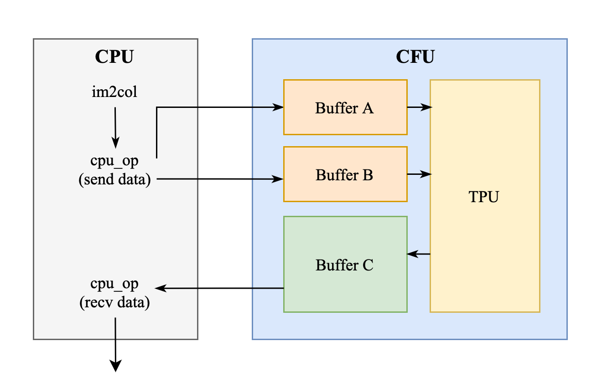

# AAML-final-project

## Introduction

This repository is the final project for Accelerator Architectures for Machine Learning (AAML) course.

The project is based on [CFU-playground](https://github.com/google/CFU-Playground), running and testing on Nexys A7-100T FPGA Board. The main goal of this project is to design and implement a CFU to accelerate Wav2Letter model for ASR tasks. This model is quantized to 8-bit integers and has 50% sparsity.

## Slides

You can find the project slides [here](https://docs.google.com/presentation/d/1n5qdwq17WNgvWcV-GogXckZgjOWUmOD-doki4P-h9Cc/edit?usp=sharing).

## Result

This project achieves **34.6x speedup** on the CFU implementation compared to the original software implementation, with lossless accuracy.

- Golden Test Cycle Count: 79264M -> 2293M
- Average Latency per inference: About 17.5 minutes -> 30.6 seconds
- WER: 27.78% (same as original inference)


## Method

After profilling, we find that almost all time-consuming part is the Conv2D layer, which accounts for 99.9% of the total cycle count.
Therefore, we design a CFU to accelerate the Conv2D layer. 

### Systolic Array

We can use im2col operation to convert the Conv2D operation to a matrix multiplication operation. Then, we can use systolic array architecture to accelerate the matrix multiplication. In this project, we implement a 4x4 systolic array to perform the matrix multiplication.

Because we have to load the input and the weight from the memory, we use 3 buffer to store the input, the weight and the output. To avoid the data transfer overhead, we use accumulation buffer (C buffer) to store the output of the systolic array and only write back to the memory when the corresponding output is ready. 


### Tiling Strategy

We find that we don't have to generate A tile every time. We can generate A tile once and reuse it for multiple systolic array computations. This reduces the repacking and memory movement.

### Requantization

Since the model is quantized to 8-bit integers, the output of the systolic array is in 32-bit integers. We need to requantize the output back to 8-bit integers. We implement the requantization in the hardware to reduce the overhead of requantization in software.

> Future Work: We can fuse the requantization with the output buffer reading. This allows us to pack four 8-bit integers into one 32-bit integer. We can further design a unit to calculate the activation function (LeakyReLU) and fuse it with the requantization.

## Getting Started

1. Set up the CFU-playground environment. You can refer to the instructions in the [CFU-playground repository](https://github.com/google/CFU-Playground).

2. Clone this repository into the `proj` directory of the CFU-playground.

```bash
cd CFU-Playground/proj
git clone https://github.com/yyh-603/wav2letter-hw-accelerator.git
```

3. Create python virtual environment and install the required packages.

```bash
python3 -m venv venv
source venv/bin/activate
pip install numpy pyserial tqdm jiwer
```

4. Download the pre-trained model weights and convert to header file.
```bash
cd AAML-2025-Project/src/wav2letter/model
wget https://github.com/ARM-software/ML-Zoo/raw/master/models/speech_recognition/wav2letter/tflite_pruned_int8/wav2letter_pruned_int8.tflite
chmod +x model_convert.sh
./model_convert.sh
```

5. Run the golden test to verify the correctness of the CFU implementation.

```bash
cd AAML-2025-Project
make prog
make load
```
and press `3` > `w` > `g` to run the golden test.

6. You can also run the python test script to evaluate the performance and the accuracy.

- run `make prog` and `make load` 
- reboot the board and close the litex terminal
- run `python test.py` to run the python test script.


